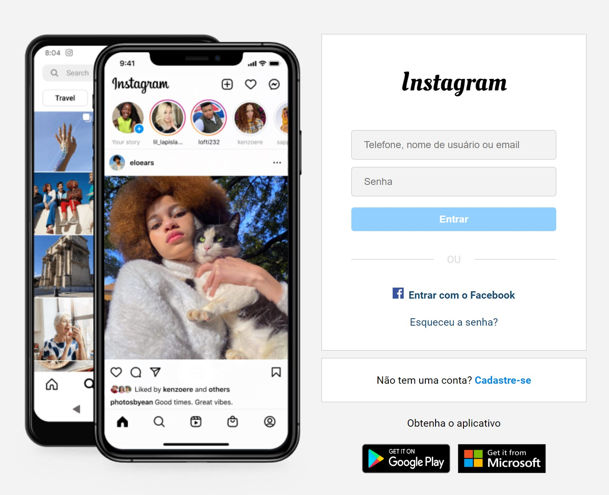

# :bookmark_tabs: Sobre o Projeto
## Clone página estática Instagram

Uma página estática da tela de login do Instagram desenvolvida como atividade prática para conclusão do módulo ***FE-JS-001 FRONT END ESTÁTICO*** no programa ***FuturoPoloTech*** da [***americanas s.a***](https://www.linkedin.com/company/americanas-sa/). em parceria com a [***Ada***](https://www.linkedin.com/school/adatechbr/).

